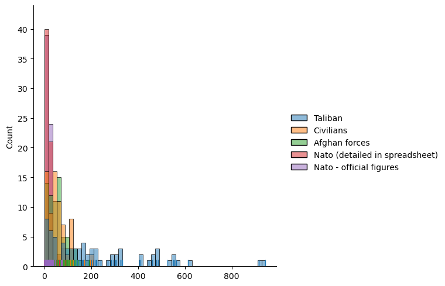
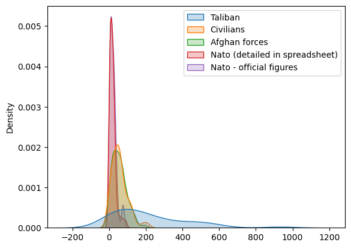
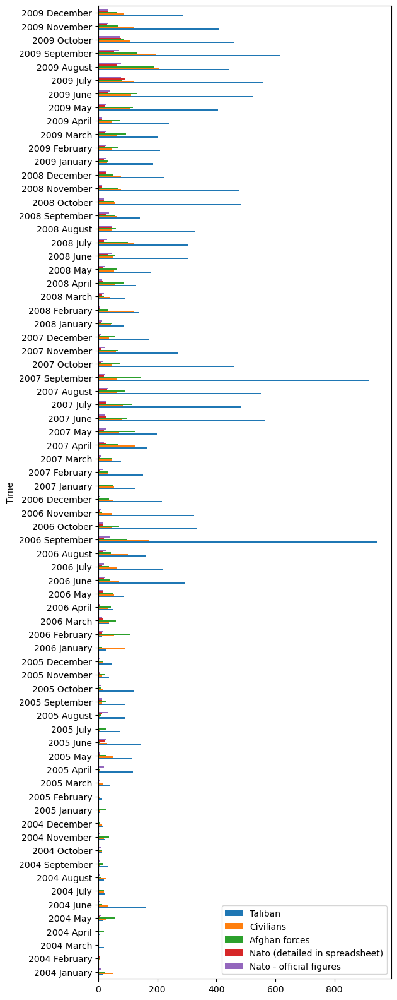
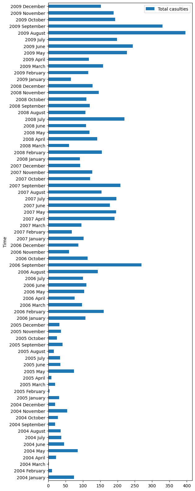
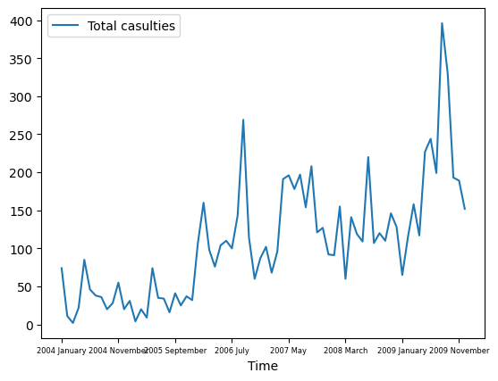

This repository is used to upload our group assignments.
Everyone in the group has the access to upload and modify files anywhere and anytime, so it's recommended to use 'Issues' to mark what you have done to the file.

The following section provides some explanation to the graphs of Assignment 2

Assignment 2 Explanation of Graphs and Data 

The following section will elaborate on several graphs and associated data from war logs of the war in Afghanistan. 

Casualties per group 

Over the course of six years, ranging from 2004 until 2009, the histogram below shows a display of the data of casualties in the Afghan war per distinctive group that is involved in the war. The x-axis does, however, not represent the given period between 2004 and 2009. The axis shows the variability for each group per month over the given period of time. For the Taliban group, one can see that the variability is significantly greater with dispersed outliers above 900 casualties (September 2007). For the Nato group one can see that the variability is far lower with a maximum of 90 in July 2009. Meanwhile, the frequency of low number of casualties ranging between 0 and 40 casualties is significantly higher, resulting in the high red peaks on the left side of the histogram. 

Figure 1: Variability histogram of data of casualties in the Afghan war per group involved per month. 

The variability of the data can also be presented in a different way, as shown in the smoothed histogram below. In this graph, the density of the value gives an indication of the frequency of certain data values per group smoothed out of the range of the specific value. Important to note is that the density values are estimates rather actual exact values. Similar observations compared to the histogram above can be drawn in terms of the variability of the casualties per group, although specific outliers are less clearly identifiable. In analyzing trends though, the smoothed histogram gives a clearer display of the general overview of the variability per group. 

 

Figure 2: Smoothed variability histogram of data of casualties in the Afghan war per group involved expressed in density of the values per month. 

 

If one is more interested in the exact number of casualties per month over the six-year period, the horizontal bar chart can give clarity, while also providing comparison between months and specific groups accordingly. As the y-axis represents time, the graph could be used for further interpretation of certain events in the war. For example, the periods around September 2006 and 2007 show significant casualties which could form a substantiation for events that have occurred in the war.  

 

Figure 3: Horizontal bar chart of casualties of the Afghan war per group involved over time shown per month. 

Total casualties 

Considering the total number of casualties recorded in the war, the two following graphs could also provide help in interpreting the data. Firstly, the horizontal bar chart shows the number of casualties over time, so that similar analyses as indicated with the horizontal bar chart per group can be performed. Additionally, the total number of casualties express more the overall severity of the war rather than what group suffers significant losses and what group does not. It could be used for more general analysis of the data. 

  

Figure 4: Horizontal bar chart of total casualties of the Afghan war over time shown per month. 

Looking more into the trend of the total number of casualties over the six-year period, the line graph could give more clarity. One can see that the total number of casualties generally increases over time with mostly peaks during summer in the years between 2006 and 2009. Considering this trend, several interpretations could be formulated, when the data is supportive to the general context and events of the war. 

 

Figure 5: Line graph of total casualties of the Afghan war over time shown per month. 

 

 